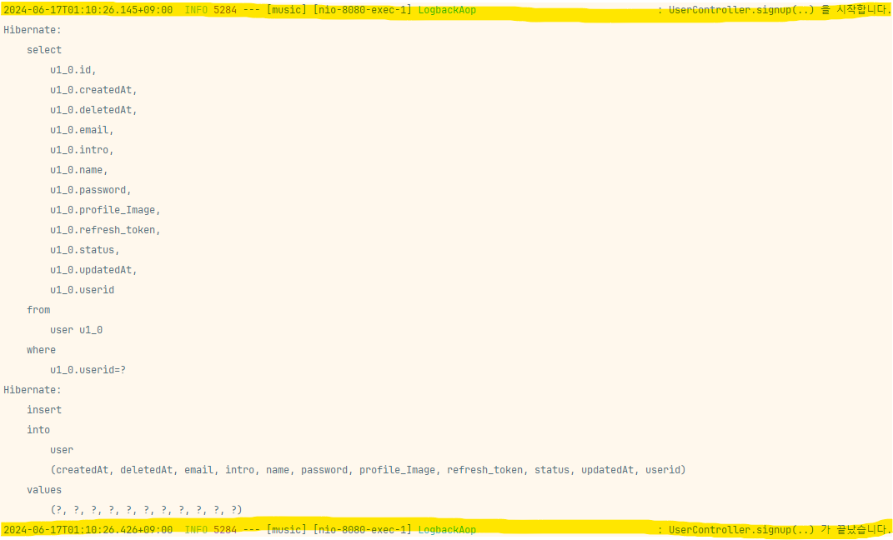
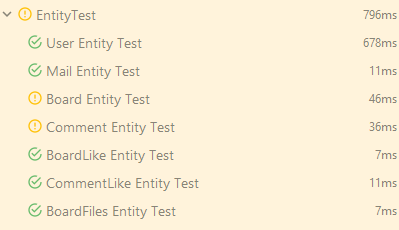

## ❗필수 구현 기능
- [X]  **🆕 AOP 추가하기**
    - 모든 API(Controller)가 호출될 때, Request 정보(Request URL, HTTP Method)를
      **@Slf4J Logback** 라이브러리를  활용하여 Log로 출력해주세요.
    - 컨트롤러 마다 로그를 출력하는 코드를 추가하는것이 아닌, AOP로 구현해야만 합니다.
```java
@Pointcut("execution(* com.prac.music.domain.board.controller.*.*(..))")
private void board() {}

@Pointcut("execution(* com.prac.music.domain.comment.controller.*.*(..))")
private void comment() {}

@Pointcut("execution(* com.prac.music.domain.like.controller.*.*(..))")
private void like() {}

@Pointcut("execution(* com.prac.music.domain.mail.controller.*.*(..))")
private void mail() {}

@Pointcut("execution(* com.prac.music.domain.user.controller.*.*(..))")
private void user() {}

@Around("board() || comment() || like() || mail() || user()" )
    public Object execute(ProceedingJoinPoint joinPoint) throws Throwable {
        log.info(joinPoint.getSignature().toShortString() + " start");

        try {

            return joinPoint.proceed();

        } finally {

            log.info(joinPoint.getSignature().toShortString() + " end");

        }
    }
```

- api가 실행될때, 끝날때 api의 이름을 출력하는 log 
  - domain 방식으로 설계된 프로젝트여서 각각의 controller를 지정하는 @Pointcut이 많은 것이 아닌가라는 생각이 든다.


- [ ]  **🆕 DTO, Entity Test 추가하기**
    - `@Test` 를 사용해서 DTO 와 Entity Test 를 추가합니다.
    - User, Post, Comment, DTO 에 존재하는 메서드들에 대해서 “**단위 테스트”** 를 추가합니다.
    - 특정 상황에 예외가 정상적으로 발생하고 있는지도 테스트 합니다.
```java
@Test
    @DisplayName("User Entity Test")
    void test1() throws IOException {
        // given
        SignupRequestDto requestDto = new SignupRequestDto(
                "testId1",
                "testPassword1!",
                "testName",
                "test@email.com",
                "test Introduce"
        );

        MultipartFile file = null;

        // when
        User user = userService.createUser(requestDto, file);

        // then
        assertEquals(requestDto.getUserId(), user.getUserId());
        assertTrue(passwordEncoder.matches(requestDto.getPassword(), user.getPassword()));
        assertEquals(requestDto.getName(), user.getName());
        assertEquals(requestDto.getEmail(), user.getEmail());
        assertEquals(requestDto.getIntro(), user.getIntro());
    }
```
- given 에 입력값, when에 생성 메서드(Post api)를 동작시켜 비교시켜 테스트

   - 게시글과 댓글은 종속된 엔티티가 테스트 코드 내에서 제대로 존재하지 않아서 통과하지 못하는 것으로 보인다.


- [ ]  **🆕 Controller Test 추가하기**
    - `@WebMvcTest` 를 사용하여 Controller Test 를 추가합니다.
    - Post, Comment Controller 에 대해서 테스트를 추가합니다.
    - 특정 상황에 예외가 정상적으로 발생하고 있는지도 테스트 합니다.

- [ ]  **🆕 Service Test 추가하기**
    - `@ExtendWith` 를 사용하여 Service Test 를 추가합니다.
    - User, UserDetails, Post, Comment Service 에 대해서 **“통합 테스트”** 를 추가합니다.
    - 단순 DB CRUD 와 별개로 코드 레벨에서의 비즈니스 로직에 대한 테스트가 필요한 경우라면 “**단위 테스트**”를 추가합니다.
        - ex) 비밀번호가 암호화 되었는가
    - 특정 상황에 예외가 정상적으로 발생하고 있는지도 테스트 합니다.